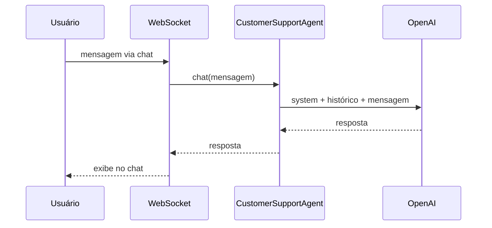

# Introdução

<center>
<iframe src="https://ai.rpmhub.dev/01introducao/slides/index.html#/" title="Introdução" width="90%" height="500" style="border:none;"></iframe>
</center>

O **Step 01** do workshop é o ponto de partida: você sobe uma aplicação Quarkus que conversa com um LLM via OpenAI e testa um chatbot funcional no navegador. Ao final deste capítulo, você terá passado pelo fluxo completo de ambiente, credencial e execução, o mesmo tipo de passo que repetirá em projetos reais.
{: .fs-3 }

## O que você vai aprender

- O que são **Quarkus**, **LLM** e **LangChain4j** e como se encaixam
- Como declarar um **AI Service** como interface Java (`@RegisterAiService`)
- A anatomia mínima do projeto Step 01 (duas classes Java + configuração)
- Por que LLMs são **stateless** e quem mantém o histórico da conversa
- Como executar `./mvnw quarkus:dev` e testar o chatbot
{: .fs-3 }

## Conceitos-chave

### Quarkus + LangChain4j

**Quarkus** é um framework Java otimizado para cloud-native: inicia rápido, consome pouca memória e oferece live reload no modo dev. **LangChain4j** é a biblioteca Java que abstrai chamadas a LLMs. Em vez de montar JSON de requisição manualmente, você declara uma interface e a biblioteca cuida do resto.
{: .fs-3 }

A extensão **Quarkus LangChain4j** integra tudo ao CDI: lê `application.properties`, gera a implementação do AI Service em build time e injeta beans com `@Inject`.
{: .fs-3 }

### AI Service

Um AI Service é uma **interface Java** anotada com `@RegisterAiService`. Não há implementação manual; o Quarkus gera o código em tempo de compilação:
{: .fs-3 }

```java
@SessionScoped
@RegisterAiService
public interface CustomerSupportAgent {

    String chat(String userMessage);
}
```
{: .fs-3 }

O método `chat` recebe a mensagem do usuário e retorna a resposta do LLM. A anotação `@SessionScoped` garante que cada sessão WebSocket tenha sua própria instância do agente (e, portanto, seu próprio histórico de conversa).
{: .fs-3 }

### Memória e statelessness

LLMs são **stateless**: cada chamada à API é independente. Para o chatbot "lembrar" do contexto, a aplicação reenvia o histórico completo da conversa a cada interação. No Step 01, o Quarkus LangChain4j gerencia isso automaticamente por sessão.
{: .fs-3 }

## Anatomia do projeto

O Step 01 tem apenas duas classes Java no backend:
{: .fs-3 }

```
section-1/step-01/
├── pom.xml
├── src/main/java/.../
│   ├── CustomerSupportAgent.java          ← interface AI Service
│   └── CustomerSupportAgentWebSocket.java ← endpoint WebSocket
└── src/main/resources/
    ├── application.properties             ← config (API key, modelo)
    └── META-INF/resources/                ← UI do chat
```
{: .fs-3 }

A configuração essencial fica em `application.properties`:
{: .fs-3 }

```properties
quarkus.langchain4j.openai.api-key=${OPENAI_API_KEY}
quarkus.langchain4j.openai.chat-model.model-name=gpt-4o
```
{: .fs-3 }

O WebSocket em `/customer-support-agent` recebe mensagens do navegador e delega ao AI Service:
{: .fs-3 }

```java
@WebSocket(path = "/customer-support-agent")
public class CustomerSupportAgentWebSocket {

    private final CustomerSupportAgent customerSupportAgent;

    @OnTextMessage
    public String onTextMessage(String message) {
        return customerSupportAgent.chat(message);
    }
}
```
{: .fs-3 }

## Fluxo da aplicação


{: .fs-3 }

## Tarefa para casa

**Objetivo:** executar localmente o **Step 01** do workshop oficial: subir o projeto Quarkus + LangChain4j e conversar com o chatbot.
{: .fs-3 }

**Referência:** [Quarkus LangChain4j Workshop, Section 1, Step 01](https://quarkus.io/quarkus-workshop-langchain4j/section-1/step-01/).
{: .fs-3 }

### Pré-requisitos

- Java 17+ instalado (`java -version`)
- Git instalado
- Conta OpenAI com créditos disponíveis
{: .fs-3 }

### O que fazer

1. Clonar o repositório do workshop e abrir o projeto `section-1/step-01` na sua IDE.
2. Obter uma **API key da OpenAI**: criar conta em [OpenAI](https://platform.openai.com/) se necessário, gerar uma chave em [API keys](https://platform.openai.com/api-keys) e exportá-la no terminal:
   ```bash
   export OPENAI_API_KEY=sk-...
   ```
   **Não** commite a chave nem coloque em arquivo versionado.
3. Verificar que `application.properties` referencia `${OPENAI_API_KEY}`.
4. Subir a aplicação:
   ```bash
   cd section-1/step-01
   ./mvnw quarkus:dev
   ```
5. Abrir `http://localhost:8080` no navegador e enviar pelo menos uma mensagem ao chatbot.
{: .fs-3 }

### Critério de sucesso

Você envia uma mensagem (por exemplo, "Olá, quero alugar um carro") e recebe uma resposta coerente do bot no chat.
{: .fs-3 }

### Troubleshooting

| Problema | Solução |
|---|---|
| `OPENAI_API_KEY not set` | Exporte a variável no mesmo terminal onde roda `./mvnw quarkus:dev` e reinicie |
| Erro 401 da OpenAI | Verifique se a chave é válida e tem créditos |
| Porta 8080 ocupada | Pare outra aplicação na porta ou configure `quarkus.http.port` |
{: .fs-3 }

## Próximo passo

Com o chatbot funcionando, avance para o trilho [AI Services](../aiservices/). Comece por [Configuration and Streaming](../02streaming/streaming.html), onde você aprende a ajustar parâmetros do modelo, fazer streaming de respostas e definir system messages.
{: .fs-3 }

# Referência

[Quarkus LangChain4j Workshop](https://quarkus.io/quarkus-workshop-langchain4j/)

<center>
<a href="https://rpmhub.dev" target="blanck"></a><br/>
<a rel="license" href="http://creativecommons.org/licenses/by/4.0/">CC BY 4.0 DEED</a>
</center>
