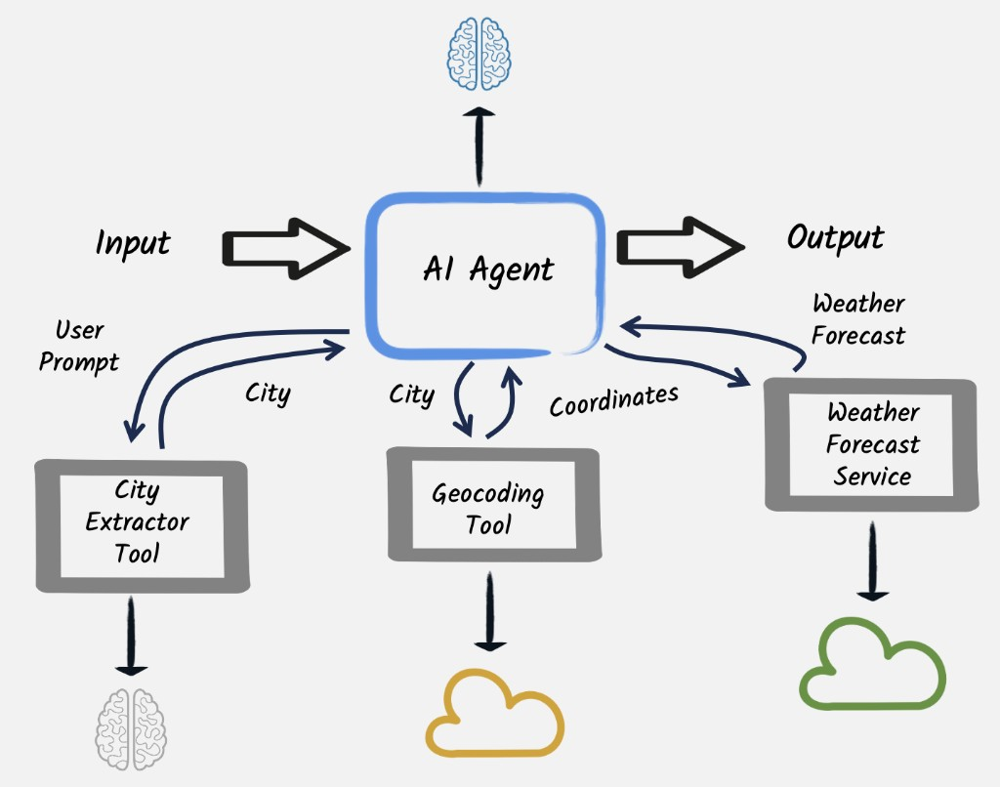

<!-- .slide: class="title-slide" -->

# Model Context Protocol

## Workshop · Section 1 · Step 08

Do Function Calling ao protocolo universal de ferramentas de IA

<p class="small">Pressione <strong>F</strong> para tela cheia · <strong>ESC</strong> para visão geral · <strong>S</strong> para notas</p>

[quarkus.io/quarkus-workshop-langchain4j](https://quarkus.io/quarkus-workshop-langchain4j/section-1/step-08/)

---

## Agenda do Step 08

1. 🔌 **O que é MCP?** Protocolo universal para ferramentas de IA
2. 🏗️ **Arquitetura:** MCP Server e MCP Client
3. 🛠️ **Criando o MCP Server:** `@Tool` e `@ToolArg` remotos
4. ⚙️ **Configurando o MCP Client:** `@McpToolBox` no AI Service
5. 🎬 **Demo:** integrando previsão do tempo ao agente de suporte

<div class="destaque">
<strong>Objetivo:</strong> entender como transformar Function Calling em um protocolo distribuído e reutilizável, permitindo que qualquer cliente MCP use as mesmas ferramentas.
</div>

Note: Este step evolui diretamente o que foi visto no Step 07. O conceito de @Tool continua, mas agora a execução acontece em um processo separado via protocolo padronizado.

---

<!-- .slide: class="section-slide" -->

# Parte 1

## O que é MCP?

---

## A limitação do Function Calling local

No Step 07, as tools eram executadas **dentro da própria aplicação**:

```
Aplicação Java
├── CustomerSupportAgent  (AI Service)
├── BookingRepository     (@Tool, local)
└── LLM ────────────────── chama BookingRepository diretamente
```

Isso funciona bem para lógica de negócio própria. Mas e quando a tool precisa ser:

* Desenvolvida em **outra linguagem** (Python, TypeScript)?
* Compartilhada entre **múltiplas aplicações**?
* Mantida por **outra equipe** de forma independente?
* Hospedada em um **serviço separado** com sua própria escala?

<div class="alerta">
Function Calling local não atende a esses requisitos. Precisamos de um protocolo distribuído.
</div>

Note: O Function Calling local é como uma chamada de método. O MCP é como uma chamada de API; permite separação de responsabilidades e reuso entre aplicações.

---

## Model Context Protocol: o conector universal

**MCP** é um protocolo aberto criado pela Anthropic (2024) para padronizar a comunicação entre agentes de IA e ferramentas/fontes de dados externas.

<div class="two-col">
<div class="col">
<h3>Sem MCP</h3>
<ul>
<li>Cada aplicação implementa sua própria integração</li>
<li>Tools acopladas ao código da aplicação</li>
<li>Difícil de reusar entre projetos</li>
<li>Sem padrão: cada LLM usa um formato diferente</li>
</ul>
</div>
<div class="col">
<h3>Com MCP</h3>
<ul>
<li>Protocolo único e padronizado</li>
<li>Tools em servidores independentes</li>
<li>Qualquer cliente MCP pode usar qualquer servidor</li>
<li>Funciona com qualquer LLM ou framework</li>
</ul>
</div>
</div>

> MCP é para ferramentas de IA o que HTTP é para a web: um protocolo comum que desacopla cliente e servidor.

Note: A analogia com HTTP é poderosa. Antes do HTTP, cada aplicação web usava seu próprio protocolo de comunicação. O MCP faz o mesmo para o ecossistema de IA.

---

## Ecossistema MCP

Hoje já existem centenas de servidores MCP públicos prontos para uso:

| Categoria | Exemplos |
|---|---|
| **Produtividade** | GitHub, Slack, Google Drive, Notion |
| **Dados** | PostgreSQL, SQLite, Elasticsearch |
| **Web** | Brave Search, Fetch (web scraping) |
| **Dev Tools** | Docker, Kubernetes, AWS |
| **Clima / Geo** | Open-Meteo, OpenStreetMap |

<div class="destaque">
Um agente Quarkus pode consumir qualquer servidor MCP público usando apenas duas linhas de configuração no <code>application.properties</code>.
</div>

Note: O ecossistema cresce rapidamente. A lista completa de servidores MCP disponíveis pode ser encontrada em modelcontextprotocol.io/servers.

---

<!-- .slide: class="section-slide" -->

# Parte 2

## Arquitetura MCP

---

## Visão geral da arquitetura



Note: A imagem mostra um AI Agent orquestrando três ferramentas encadeadas: City Extractor (extrai cidade do prompt), Geocoding Tool (cidade → coordenadas) e Weather Forecast Service (coordenadas → previsão). O MCP padroniza como cada uma dessas tools é exposta e invocada.

---

## Fluxo de dados entre as tools

```
User Prompt: "Qual é o clima em Porto Alegre?"
        ↓
  City Extractor Tool
        → "Porto Alegre"
        ↓
  Geocoding Tool
        → latitude: -30.03, longitude: -51.23
        ↓
  Weather Forecast Service (MCP)
        → temperatura, precipitação, previsão
        ↓
  AI Agent combina tudo → resposta ao usuário
```

<div class="destaque">
Cada tool recebe o resultado da anterior. O AI Agent <strong>orquestra</strong> esse encadeamento automaticamente, decidindo a sequência ideal de chamadas.
</div>

Note: O MCP Client faz parte da aplicação principal. O MCP Server é um processo separado. A comunicação usa HTTP com Server-Sent Events (SSE) para streaming.

---

## O transporte: HTTP + SSE

O MCP suporta diferentes tipos de transporte. No workshop usamos **HTTP com SSE**:

* **HTTP:** requisições síncronas para invocar tools
* **SSE (Server-Sent Events):** streaming de eventos do servidor para o cliente

```properties
# Configuração do MCP Client na aplicação principal
quarkus.langchain4j.mcp.weather.transport-type=http
quarkus.langchain4j.mcp.weather.url=http://localhost:8081/mcp/sse/
```

<div class="dica">
<strong>Outros transportes disponíveis:</strong> <code>stdio</code> para processos locais (ex.: CLI tools) e <code>websocket</code> para comunicação bidirecional em tempo real.
</div>

Note: O transporte stdio é útil para ferramentas que rodam como subprocessos, como o Claude Desktop usa para conectar a servidores MCP locais.

---

## Ciclo completo com MCP

```
1. Usuário pergunta sobre a reserva e previsão do tempo
        ↓
2. AI Service envia ao LLM:
   - Mensagem do usuário
   - Tools locais (BookingRepository)
   - Tools remotas (Weather, via MCP)
        ↓
3. LLM chama getBookingDetails() → local → resultado
        ↓
4. LLM chama getForecast(lat, lon) → MCP Client
        ↓
5. MCP Client → HTTP → MCP Server → api.open-meteo.com
        ↓
6. Resultado volta: MCP Server → MCP Client → LLM
        ↓
7. LLM combina dados da reserva + clima → resposta final
        ↓
8. Usuário recebe resposta personalizada
```

Note: O LLM não sabe se a tool é local ou remota. Do ponto de vista do modelo, é tudo a mesma coisa: ele recebe uma lista de tools e invoca as que julgar necessárias.

---

<!-- .slide: class="section-slide" -->

# Parte 3

## Criando o MCP Server

---

## Gerando o projeto do servidor

```bash
quarkus create app \
  dev.langchain4j.quarkus.workshop:mcp-server:1.0-SNAPSHOT \
  -x quarkus-mcp-server-sse \
  -x quarkus-rest-client-jackson
```

Duas extensões necessárias:

| Extensão | Papel |
|---|---|
| `quarkus-mcp-server-sse` | Expõe as tools via protocolo MCP com transporte SSE |
| `quarkus-rest-client-jackson` | Permite chamar APIs REST externas com deserialização JSON |

<div class="dica">
<strong>Separação de projetos:</strong> o MCP Server é um projeto Quarkus independente. Ele tem seu próprio <code>pom.xml</code>, porta HTTP e ciclo de vida.
</div>

Note: A separação em projetos distintos é intencional. O servidor MCP pode ser implantado e escalado independentemente da aplicação cliente.

---

## REST Client para a API meteorológica

```java
@Path("/v1/forecast")
@RegisterRestClient(configKey = "weatherclient")
public interface WeatherClient {

    @GET
    String getForecast(
            @RestQuery double latitude,
            @RestQuery double longitude,
            @RestQuery int forecastDays,
            @RestQuery String hourly
    );
}
```

* `@RegisterRestClient` registra a interface como cliente REST no CDI
* `configKey = "weatherclient"` mapeia para propriedades `quarkus.rest-client."weatherclient".*`
* Quarkus gera automaticamente a implementação (**zero código de plumbing**)

Note: A anotação @RestQuery equivale a @QueryParam do JAX-RS, mas com menos verbosidade. O Quarkus cuida da serialização dos parâmetros na URL.

---

## Definindo a Tool no servidor

```java
public class Weather {

    @RestClient
    WeatherClient weatherClient;

    @Tool(description = "Get weather forecast for a location.")
    String getForecast(
            @ToolArg(description = "Latitude of the location")
            double latitude,

            @ToolArg(description = "Longitude of the location")
            double longitude) {

        return weatherClient.getForecast(
                latitude,
                longitude,
                16,
                "temperature_2m,snowfall,rain,precipitation," +
                "precipitation_probability");
    }
}
```

<div class="destaque">
<strong>@ToolArg</strong> fornece ao LLM a descrição semântica de cada parâmetro. Quanto mais descritivo, melhor o LLM inferirá os valores corretos.
</div>

Note: Diferença para o Function Calling local: aqui usamos @ToolArg do pacote MCP Server, não apenas nomes de parâmetros. Isso enriquece o JSON Schema enviado ao LLM.

---

## @Tool local vs. @Tool no MCP Server

<div class="two-col">
<div class="col">
<h3>Function Calling (local)</h3>

```java
// BookingRepository.java
@ApplicationScoped
public class BookingRepository {

    @Tool("Get booking details")
    @Transactional
    public Booking getBookingDetails(
            long bookingId,
            String firstName,
            String lastName) {
        // acesso ao banco local
    }
}
```

</div>
<div class="col">
<h3>MCP Server (remoto)</h3>

```java
// Weather.java (outro processo)
public class Weather {

    @Tool(description =
        "Get weather forecast.")
    String getForecast(
        @ToolArg(description =
            "Latitude of the location")
        double latitude,
        @ToolArg(description =
            "Longitude of the location")
        double longitude) {
        // chamada REST externa
    }
}
```

</div>
</div>

Note: A estrutura é muito similar. A principal diferença é o contexto de execução: um roda dentro da aplicação, o outro em um processo externo acessível via HTTP.

---

## Configurando o MCP Server

```properties
# Porta separada da aplicação cliente
quarkus.http.port=8081

# Identificação do servidor MCP
quarkus.mcp.server.server-info.name=Weather Service

# Logs de tráfego MCP (útil em dev)
quarkus.mcp.server.traffic-logging.enabled=true
quarkus.mcp.server.traffic-logging.text-limit=100

# REST Client para a API meteorológica
quarkus.rest-client.logging.scope=request-response
quarkus.rest-client.follow-redirects=true
quarkus.rest-client.logging.body-limit=50
quarkus.rest-client."weatherclient".uri=https://api.open-meteo.com/
```

<div class="dica">
<strong>Iniciando o servidor:</strong> <code>./mvnw quarkus:dev</code> a partir do diretório do MCP Server. Mantenha este terminal aberto enquanto testa a aplicação cliente.
</div>

---

<!-- .slide: class="section-slide" -->

# Parte 4

## Configurando o MCP Client

---

## Dependência no projeto cliente

No `pom.xml` da **aplicação principal** (não do MCP Server):

```xml
<dependency>
    <groupId>io.quarkiverse.langchain4j</groupId>
    <artifactId>quarkus-langchain4j-mcp</artifactId>
</dependency>
```

Ou via CLI:

```bash
./mvnw quarkus:add-extension -Dextensions="quarkus-langchain4j-mcp"
```

<div class="destaque">
Esta dependência habilita o <strong>MCP Client</strong> no Quarkus LangChain4j. Ela é responsável por descobrir as tools do servidor, serializá-las ao LLM e rotear as chamadas de volta ao servidor.
</div>

---

## Configurando a conexão ao MCP Server

No `application.properties` da aplicação principal:

```properties
quarkus.langchain4j.mcp.weather.transport-type=http
quarkus.langchain4j.mcp.weather.url=http://localhost:8081/mcp/sse/
```

O identificador `weather` na chave de configuração será usado em `@McpToolBox`:

```java
@McpToolBox("weather")   // ← referencia a config "mcp.weather.*"
String chat(String userMessage);
```

<div class="dica">
<strong>Múltiplos servidores MCP:</strong> é possível configurar vários servidores usando identificadores distintos e referenciá-los com múltiplas anotações <code>@McpToolBox</code>.
</div>

---

## AI Service com tools locais e remotas

```java
@SessionScoped
@RegisterAiService
public interface CustomerSupportAgent {

    @SystemMessage("""
            You are a customer support agent of a car rental company
            'Miles of Smiles'. You are friendly, polite and concise.

            When calling tools or functions, strictly use JSON objects,
            do not wrap in quotes or use plain strings.

            When asked to provide details about a reservation,
            provide weather details and gently try to upsell the customer
            based on this info.

            Today is {current_date}.
            """)
    @ToolBox(BookingRepository.class)    // ← tools locais
    @McpToolBox("weather")               // ← tools remotas via MCP
    String chat(String userMessage);
}
```

Note: O system message instrui o LLM a usar a previsão do tempo para fazer upsell de equipamentos (correntes de neve, guarda-chuva, etc.). Isso demonstra como o contexto meteorológico enriquece a experiência do cliente.

---

## O que o LLM enxerga

Do ponto de vista do LLM, ele recebe uma lista consolidada de tools, sem distinção entre locais e remotas:

```json
{
  "tools": [
    {
      "name": "cancelBooking",
      "description": "Cancel a booking",
      "parameters": { ... }
    },
    {
      "name": "getBookingDetails",
      "description": "Get booking details",
      "parameters": { ... }
    },
    {
      "name": "getForecast",
      "description": "Get weather forecast for a location.",
      "parameters": {
        "latitude":  { "description": "Latitude of the location" },
        "longitude": { "description": "Longitude of the location" }
      }
    }
  ]
}
```

<div class="destaque">
O LLM <strong>não sabe</strong> se a tool é local ou remota. O framework cuida de toda a roteação transparentemente.
</div>

---

<!-- .slide: class="section-slide" -->

# Parte 5

## Demo: testando na prática

---

## Conversa com dados climáticos

<div class="two-col">
<div class="col">
<h3>💬 Conversa</h3>
<p><strong>Usuário:</strong> I'd like information about my booking.</p>
<p><strong>AI:</strong> Sure! Please provide your name and booking ID.</p>
<p><strong>Usuário:</strong> I'm Speedy McWheels, booking ID 2.</p>
<p><strong>AI:</strong> Booking #2, São Paulo, Sep 17-19.</p>
<p><strong>Usuário:</strong> Do I need snow chains?</p>
<p><strong>AI:</strong> For São Paulo in September: 23–25°C, no precipitation expected. Snow chains won't be needed, but a light jacket is recommended for the evenings!</p>
</div>
<div class="col">
<h3>⚙️ Nos bastidores</h3>
<ol>
<li>LLM chama <code>getBookingDetails(2, "Speedy", "McWheels")</code></li>
<li>Retorna localização: São Paulo, −23.55°, −46.63°</li>
<li>LLM chama <code>getForecast(−23.55, −46.63)</code></li>
<li>MCP Client → HTTP → MCP Server</li>
<li>MCP Server → api.open-meteo.com</li>
<li>Dados climáticos retornam ao LLM</li>
<li>LLM formula resposta com contexto</li>
</ol>
</div>
</div>

Note: O LLM encadeou duas tools de fontes diferentes: uma local (banco de dados) e uma remota (API meteorológica via MCP). Isso é o que torna a experiência rica.

---

## Verificando os logs do MCP Server

Com `traffic-logging` habilitado, o servidor exibe o tráfego MCP:

```
INFO  MCP ← {"jsonrpc":"2.0","method":"tools/list","id":1}
INFO  MCP → {"jsonrpc":"2.0","id":1,"result":{"tools":[
              {"name":"getForecast",
               "description":"Get weather forecast for a location.",
               "inputSchema":{...}}]}}

INFO  MCP ← {"jsonrpc":"2.0","method":"tools/call",
              "params":{"name":"getForecast",
                        "arguments":{"latitude":-23.55,
                                     "longitude":-46.63}}}
INFO  MCP → {"jsonrpc":"2.0","result":{"content":[
              {"type":"text","text":"{\"hourly\":{...}}"}]}}
```

<div class="dica">
Os logs mostram o protocolo MCP em ação: primeiro o cliente descobre as tools disponíveis (<code>tools/list</code>), depois invoca a desejada (<code>tools/call</code>).
</div>

---

## O que aprendemos

* **MCP** é o protocolo padrão para conectar agentes de IA a ferramentas e dados externos
* Um **MCP Server** expõe tools via HTTP/SSE, em qualquer linguagem, em qualquer infraestrutura
* Um **MCP Client** descobre e invoca essas tools de forma transparente para o LLM
* **`@McpToolBox`** conecta o AI Service ao servidor MCP pelo nome configurado
* **Tools locais e remotas coexistem** no mesmo AI Service sem conflito
* O LLM **não distingue** tools locais de remotas; o framework gerencia a roteação
* MCP transforma o ecossistema de ferramentas em um **marketplace reutilizável**

---

## Recursos & links

**Tutorial oficial**

* 📖 [Step 08, Model Context Protocol](https://quarkus.io/quarkus-workshop-langchain4j/section-1/step-08/)

**Documentação**

* 📖 [Quarkus LangChain4j, MCP](https://docs.quarkiverse.io/quarkus-langchain4j/dev/mcp.html)
* 📖 [Quarkus MCP Server](https://docs.quarkiverse.io/quarkus-mcp-server/dev/index.html)

**Conceitos e ecossistema**

* 🔗 [Model Context Protocol: Especificação oficial](https://modelcontextprotocol.io/)
* 🔗 [MCP Servers: Diretório de servidores públicos](https://modelcontextprotocol.io/servers)
* 🔗 [Open-Meteo API (usado no demo)](https://open-meteo.com/)
