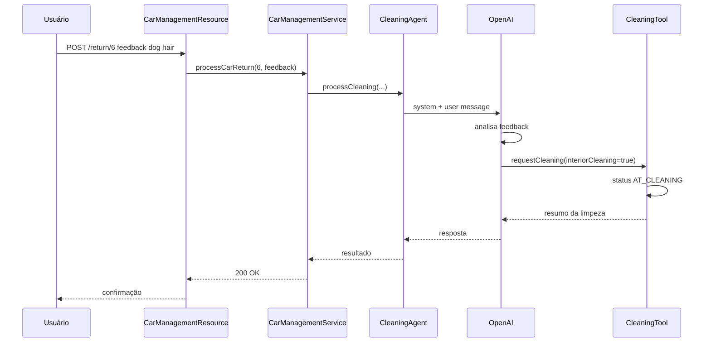
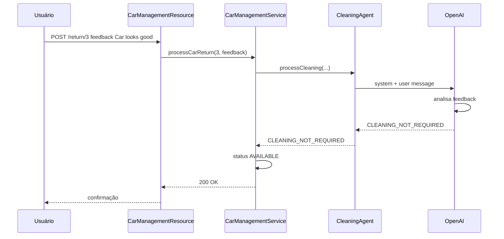

# Implementing AI Agents

<center>
<iframe src="https://ai.rpmhub.dev/07agents/slides/index.html#/" title="Implementing AI Agents" width="90%" height="500" style="border:none;"></iframe>
</center>

Parabéns por concluir a Section 1! Você aprendeu a construir aplicações com chatbots, RAG, function calling, MCP e guardrails. Agora, na **Section 2**, o foco muda: em vez de um chatbot que responde a perguntas, você vai construir **agentes autônomos** que tomam decisões, invocam tools e colaboram em workflows.
{: .fs-3 }

Este capítulo cobre o [Step 01 da Section 2](https://quarkus.io/quarkus-workshop-langchain4j/section-2/step-01/) — seu primeiro agente autônomo usando o módulo `quarkus-langchain4j-agentic`.
{: .fs-3 }

## AI Services vs. AI Agents

Antes de mergulhar no código, entenda a diferença entre os dois padrões:
{: .fs-3 }

| Aspecto | AI Services (Section 1) | AI Agents (Section 2) |
|---|---|---|
| **Propósito** | Responder perguntas do usuário | Executar tarefas autônomas |
| **Interação** | Reativa (responde a prompts) | Reativa e proativa (toma ações) |
| **Uso de tools** | Pode chamar tools quando necessário | Chama tools para atingir objetivos |
| **Workflows** | Interações single-agent | Colaboração multi-agente |
| **Anotação** | `@SystemMessage` + `@UserMessage` | Um método com `@Agent` |
| **Casos de uso** | Chatbots, Q&A, geração de conteúdo | Automação, decisão, orquestração |

## Cenário: gestão de frota

A **Miles of Smiles** precisa gerenciar a frota de veículos. O fluxo de negócio:
{: .fs-3 }

1. **Devolução:** a equipe de locação registra feedback sobre o estado do carro
2. **Limpeza:** o sistema decide automaticamente se o carro precisa de limpeza
3. **Retorno da limpeza:** após limpeza, o carro volta ao pool disponível
4. **Disponibilidade:** carros limpos e sem problemas ficam disponíveis para locação
{: .fs-3 }

Seu trabalho: construir um **agente de limpeza** que analisa o feedback e decide inteligentemente se deve solicitar limpeza.
{: .fs-3 }

## Arquitetura da aplicação

A aplicação tem quatro componentes principais:
{: .fs-3 }

```
CarManagementResource  →  REST API (endpoint de devolução)
CarManagementService   →  lógica de negócio + invocação do agente
CleaningAgent          →  agente AI que decide se limpeza é necessária
CleaningTool           →  tool que solicita serviços de limpeza
```
{: .fs-3 }

### Dependência

No `pom.xml`, a dependência que habilita agentes:
{: .fs-3 }

```xml
<dependency>
    <groupId>io.quarkiverse.langchain4j</groupId>
    <artifactId>quarkus-langchain4j-agentic</artifactId>
</dependency>
```
{: .fs-3 }

## Componente 1: REST API

O `CarManagementResource` expõe o endpoint de devolução de carros:
{: .fs-3 }

```java
@Path("/car-management")
public class CarManagementResource {

    @Inject
    CarManagementService carManagementService;

    @POST
    @Path("/return/{carNumber}")
    public Response processReturn(Integer carNumber, @RestQuery String feedback) {
        try {
            String result = carManagementService.processCarReturn(
                    carNumber, feedback != null ? feedback : "");
            return Response.ok(result).build();
        } catch (Exception e) {
            Log.error(e.getMessage(), e);
            return Response.status(Response.Status.INTERNAL_SERVER_ERROR)
                    .entity("Error processing return: " + e.getMessage())
                    .build();
        }
    }
}
```
{: .fs-3 }

## Componente 2: lógica de negócio

O `CarManagementService` orquestra a devolução e invoca o agente:
{: .fs-3 }

```java
@Inject
CleaningAgent cleaningAgent;

@Transactional
public String processCarReturn(Integer carNumber, String feedback) {
    CarInfo carInfo = CarInfo.findById(carNumber);
    if (carInfo == null) {
        return "Car not found with number: " + carNumber;
    }

    String result = cleaningAgent.processCleaning(carInfo, carNumber, feedback);

    if (result.toUpperCase().contains("CLEANING_NOT_REQUIRED")) {
        carInfo.status = CarStatus.AVAILABLE;
        carInfo.persist();
    }

    return result;
}
```
{: .fs-3 }

Se a resposta contém `CLEANING_NOT_REQUIRED`, o carro volta para `AVAILABLE`. Caso contrário, a tool já atualizou o status para `AT_CLEANING`.
{: .fs-3 }

## Componente 3: CleaningAgent

Aqui está o coração do agente — uma interface com anotações especiais:
{: .fs-3 }

```java
public interface CleaningAgent {

    @SystemMessage("""
        You handle intake for the cleaning department of a car rental company.
        It is your job to submit a request to the provided requestCleaning function to take action based on the provided feedback.
        Be specific about what services are needed.
        If no cleaning is needed based on the feedback, respond with "CLEANING_NOT_REQUIRED".
        """)
    @UserMessage("""
        Car Information:
        Make: {carInfo.make}
        Model: {carInfo.model}
        Year: {carInfo.year}
        Car Number: {carNumber}

        Feedback: {feedback}
        """)
    @Agent("Cleaning specialist. Determines what cleaning services are needed.")
    @ToolBox(CleaningTool.class)
    String processCleaning(
            CarInfo carInfo,
            Integer carNumber,
            String feedback);
}
```
{: .fs-3 }

### Anotações explicadas

| Anotação | Papel |
|---|---|
| `@SystemMessage` | Define o **papel** e a **lógica de decisão** do agente |
| `@UserMessage` | Fornece **contexto** por requisição (dados do carro + feedback) |
| `@Agent` | Marca o método como ponto de entrada do agente — **apenas um por interface** |
| `@ToolBox` | Atribui tools que o agente pode invocar |

> **Dica:** a `@SystemMessage` é crítica. Ela diz ao agente **quem** ele é, **o que** fazer, **quando** agir e **como** responder (`CLEANING_NOT_REQUIRED` ou chamar a tool).
{: .fs-3 }

> **Atenção:** diferente de um AI Service, um agente tem **apenas um método** anotado com `@Agent`. Ele é projetado para ação autônoma, não para conversação contínua.
{: .fs-3 }

Não há implementação manual — o LangChain4j gera o código que envia system + user messages ao LLM, invoca a tool se necessário e retorna a resposta.
{: .fs-3 }

## Componente 4: CleaningTool

Tools em agentes funcionam como na Section 1 — métodos anotados com `@Tool`:
{: .fs-3 }

```java
@ApplicationScoped
public class CleaningTool {

    @Tool("Requests a cleaning with the specified options")
    @Transactional
    public String requestCleaning(
            Integer carNumber,
            String carMake,
            String carModel,
            Integer carYear,
            boolean exteriorWash,
            boolean interiorCleaning,
            boolean detailing,
            boolean waxing,
            String requestText) {

        CarInfo carInfo = CarInfo.findById(carNumber);
        if (carInfo != null) {
            carInfo.status = CarStatus.AT_CLEANING;
            carInfo.persist();
        }

        var result = generateCleaningSummary(carNumber, carMake, carModel, carYear,
                                              exteriorWash, interiorCleaning, detailing,
                                              waxing, requestText);
        System.out.println("🚗 CleaningTool result: " + result);
        return result;
    }
}
```
{: .fs-3 }

## Como tudo funciona junto

### Cenário 1: carro precisa de limpeza


{: .fs-3 }

Feedback: `"Car has dog hair all over the back seat"` → agente reconhece necessidade de limpeza interior → chama `CleaningTool` → carro vai para `AT_CLEANING`.
{: .fs-3 }

### Cenário 2: carro está limpo


{: .fs-3 }

Feedback: `"Car looks good"` → agente decide que não precisa de limpeza → retorna `CLEANING_NOT_REQUIRED` **sem chamar a tool** → carro volta para `AVAILABLE`. Isso demonstra **raciocínio autônomo**.
{: .fs-3 }

## Testando a aplicação

```bash
cd section-2/step-01
./mvnw quarkus:dev
```

Abra `http://localhost:8080`. A UI mostra a frota e um formulário de feedback para carros alugados ou em limpeza.
{: .fs-3 }

| Teste | Feedback | Resultado esperado |
|---|---|---|
| 1 | `Car has dog hair all over the back seat` | Status → `AT_CLEANING`, log da CleaningTool |
| 2 | `Car looks good` | Status → `AVAILABLE`, resposta `CLEANING_NOT_REQUIRED` |

## O que aprendemos

* **AI Agents** tomam decisões autônomas e executam ações via tools
* A anotação `@Agent` marca o ponto de entrada — **um método por interface**
* Agents reutilizam `@SystemMessage`, `@UserMessage` e `@ToolBox` da Section 1
* O agente pode **decidir não agir** (sem chamar a tool) com base no contexto
* A integração com CDI é transparente — injete o agente como qualquer bean Quarkus
{: .fs-3 }

## Experimentos sugeridos

1. **Edge cases:** teste `"The trunk smells like fish"`, `"Minor scratch on the bumper"`, `"Spotless condition"` — o agente chama a tool?
2. **System message:** altere para um especialista mais exigente que pede detail completo a menos que o carro esteja perfeito
3. **Novo parâmetro:** adicione `tireCleaning` ao `CleaningTool` — o agente aprende a usá-lo?
{: .fs-3 }

## Troubleshooting

| Problema | Solução |
|---|---|
| `OPENAI_API_KEY not set` | Exporte a variável e reinicie a aplicação |
| Tool nunca é chamada | Revise a `@SystemMessage` — instruções claras sobre quando usar a tool |
| Tool sempre é chamada | Adicione exemplos explícitos de quando retornar `CLEANING_NOT_REQUIRED` |
| Tool não registrada | Verifique `@Tool` na tool e referência em `@ToolBox` |
{: .fs-3 }

## Tarefa para casa

**Objetivo:** executar o **Step 01 da Section 2** e validar os dois cenários de devolução de carro.
{: .fs-3 }

**Referência:** [Quarkus LangChain4j Workshop — Section 2, Step 01](https://quarkus.io/quarkus-workshop-langchain4j/section-2/step-01/).
{: .fs-3 }

### O que fazer

1. Navegar até `section-2/step-01` e subir com `./mvnw quarkus:dev`.
2. Abrir `http://localhost:8080` e localizar um carro alugado na grade.
3. Testar devolução com feedback de limpeza (`Car has dog hair all over the back seat`) — verificar status `AT_CLEANING` e log da tool.
4. Testar devolução com carro limpo (`Car looks good`) — verificar status `AVAILABLE`.
5. Observar nos logs a decisão do agente em cada caso.
{: .fs-3 }

# Referência

[Quarkus LangChain4j Workshop — Section 2, Step 01](https://quarkus.io/quarkus-workshop-langchain4j/section-2/step-01/)
{: .fs-3 }

<center>
<a href="https://rpmhub.dev" target="blanck"></a><br/>
<a rel="license" href="http://creativecommons.org/licenses/by/4.0/">CC BY 4.0 DEED</a>
</center>
